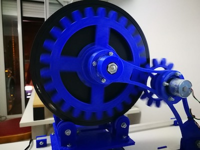
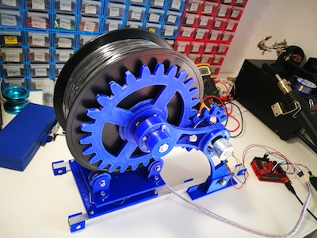

# 3D Printer Filament Dispenser and Monitor
Communicates with your serial USB port with any USB connected device with this motorised version of the filament dispenser.

## Hardware

 
**_Micro Controller Platform_**: The _3D Printer filament dispenser_ software can work on [**Arduino**](http://export.farnell.com/arduino/a000066/atmega328-arduino-uno-eval-board/dp/2075382?ICID=I-HP-PP-Arduino-A000066) and the [**Infineon XMC 1100**](http://export.farnell.com/infineon/kit-xmc11-boot-001/cortex-m0-evaluation-board/dp/2376496) Arduino compatible board (that works better and faster).

**_DC Motor Shield_**: The DC motor is controlled by the **Infineon TLE97112LE** DC Motor controller shield for Arduino

**_Motor_**: Motion if actuated by a [**McLennan brushed DC Motor, DC 12 V**](http://export.farnell.com/mclennan/1271-12-10/motor-geared-12v-165rpm/dp/1784829)

**_Sensor_**: The weight sensor is a max 5Kg inexpensive load sensor connected to an AD amplifier board based on the **HX711** IC, specialised for load cells control.

**_Filament base_**: The filament base assemble the load cell sensor holding the MX711 AD filter acting as the support for the filament Roll. The base has four rotating bearings to reduce noise and friction.

## Application note

This software is also compatible with the non-motorised verson of the filament roll monitor and dispenser superseeding the previous version. To use the sketch without the motor just '<\#undef _USE_MOTOR>' in filament.h

